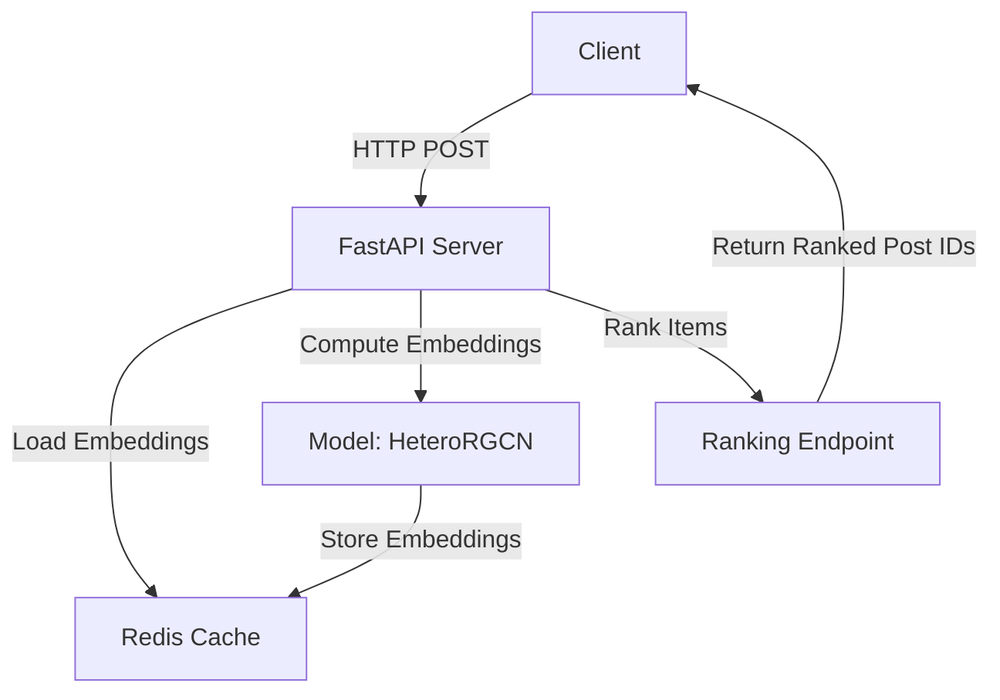

# Reddit Graph Embeddding API

This project provides a FastAPI-based API for ranking Reddit posts using graph embeddings. It leverages a heterogeneous graph model (HeteroRGCN) to compute embeddings for users and posts, and uses Redis for caching these embeddings.

## Architecture Diagram

Below is a detailed architecture diagram for this project:



### Components:
- **Client**: Sends HTTP POST requests to the FastAPI server.
- **FastAPI Server**: Handles incoming requests, loads or computes embeddings, and ranks items.
- **Redis Cache**: Stores and retrieves embeddings for users and posts.
- **Model (HeteroRGCN)**: Computes embeddings for nodes in the graph.
- **Ranking Endpoint**: Ranks candidate posts for a given user based on embedding similarity.

## 🚀 Getting Started

### Prerequisites
- Python 3.8+
- Redis server running locally or accessible via environment variables

### Installation
1. Clone the repository:
   ```bash
   git clone https://github.com/yourusername/reddit-ls-embedding.git
   cd reddit-ls-embedding
   ```

2. Install dependencies:
   ```bash
   pip install -r requirements.txt
   ```

3. Set up environment variables (optional):
   ```bash
   cp .env.example .env
   # Edit .env with your Redis configuration
   ```

### Running the API
Start the FastAPI server:
```bash
uvicorn src.serving.app:app --reload --port 8001
```

The API will be available at `http://localhost:8001`.

## 📝 API Endpoints

### Rank Items
- **POST** `/rank_items`
  - **Request Body**:
    ```json
    {
      "user_id": 793,
      "candidate_post_ids": [101, 102, 103]
    }
    ```
  - **Response**:
    ```json
    {
      "user_id": 793,
      "ranked_post_ids": [101, 102, 103]
    }
    ```

## 📊 Performance Metrics

- **Latency**: Average response time for ranking requests
- **Throughput**: Number of requests processed per second
- **Cache Hit Rate**: Percentage of embedding requests served from Redis cache

## 🔄 CI/CD Pipeline

- **GitHub Actions**: Automated testing and deployment
- **Docker**: Containerized deployment for consistent environments

## 📈 A/B Testing Framework

- **Feature Flags**: Toggle new ranking algorithms
- **Metrics Collection**: Compare performance of different ranking strategies

## 📚 Documentation

- **API Documentation**: Available at `/docs` when the server is running
- **Code Documentation**: Inline comments and docstrings

## 🤝 Contributing

1. Fork the repository
2. Create your feature branch (`git checkout -b feature/amazing-feature`)
3. Commit your changes (`git commit -m 'Add some amazing feature'`)
4. Push to the branch (`git push origin feature/amazing-feature`)
5. Open a Pull Request

## 📄 License

This project is licensed under the MIT License - see the [LICENSE](LICENSE) file for details.